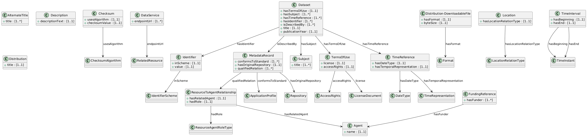

# CCMM to DataCite Mapping

NOTE work in progress: towards exhaustive mappings

This repository contains material related to CCMM to DataCite mutual mapping.

## Introduction

This document describes the background and the methodology for the design of CCMM and DataCite mapping. The motivation for mapping of CCMM and DataCite is the need of aligning CCMM metadata with DataCite metadata and vice versa, i.e. DataCite-compliant representation of CCMM metadata and CCMM-compliant representation of DataCite metadata. The need stems from the fact that metadata catalogues can support either CCMM model or DataCite model.

## Background

### CCMM (version 1.1.0)

"The Czech Core Metadata Model for Research Data (abbreviated as CCMM) is a core metadata model for research data description in the Czech Republic, it is an output of the Czech Academic and Research Discovery Services project, hereinafter referred to as CARDS." [https://www.ccmm.cz/en/core-model-ccmm/model-purpose-and-objectives/]

- Web: https://model.ccmm.cz/research-data/en/#Dataset
- XML Schema: https://model.ccmm.cz/research-data/dataset/schema.xsd
- Examples: https://github.com/techlib/CCMM/tree/main/_metadata-samples/xml

#### CCMM: Mandatory elements



Agent.name

AlternateTitle.title

Checksum.checksumValue

Checksum.usesAlgorithm

DataService.endpointUrl

Dataset.hasIdentifier

Dataset.hasSubject

Dataset.hasTermsOfUse

Dataset.hasTimeReference

Dataset.isDescribedBy

Dataset.publicationYear

Dataset.title

Description.descriptionText

Distribution.title

Distribution-DownloadableFile.byteSize

Distribution-DownloadableFile.hasFormat

FundingReference.hasFunder

Identifier.inScheme

Identifier.value

Location.hasLocationRelationType

MetadataRecord.conformsToStandard

MetadataRecord.hasOriginalRepository

MetadataRecord.qualifiedRelation

ResourceToAgentRelationship.hadRole

ResourceToAgentRelationship.hasRelatedAgent

Subject.title

TermsOfUse.accessRights

TermsOfUse.license

TimeInterval.hasBeginning

TimeInterval.hasEnd

TimeReference.hasDateType

TimeReference.hasTemporalRepresentation


### DataCite

"The DataCite Metadata Schema is a list of core metadata properties chosen for accurate and consistent identification of a resource for citation and retrieval purposes, with recommended use instructions in the documentation. The DataCite Metadata Schema is suitable for a wide range of resource types—from samples and images to data and preprints." [https://datacite-metadata-schema.readthedocs.io/en/4.6/introduction/about-schema/] It is currently, one of the most widely used Semantic Web vocabularies for describing datasets and data catalogues.

- Web: https://datacite-metadata-schema.readthedocs.io/en/4.6/
- Examples and XML Schema: https://datacite-metadata-schema.readthedocs.io/en/4.6/xml/
    - The XML Schema: https://schema.datacite.org/meta/kernel-4.6/metadata.xsd
    - Full Example: https://schema.datacite.org/meta/kernel-4.6/example/datacite-example-full-v4.xml

#### Mandatory elements in DataCite

`\resource\identifier`

`\resource\creators`

`\resource\titles`

`\resource\publisher`

`\resource\publicationYear`

`\resource\resourceType`

## Methodology

CCMM DataCite Mapping Methodology is as follows

1. Initial alignment is based on high-level (vocabulary-level) comparison of the metadata elements defined in CCMM 1.1.0 (https://model.ccmm.cz/research-data/en/dsv.ttl) and in DataCite in-house vocabulary representation in OWL (https://model.ccmm.cz/vocabulary/datacite/model.owl.ttl)

    1.1. **Straightforwad approach**: CCMM is partly derived from DataCite vocabulary. Precisely, several CCMM elements are profiled from Datacite elements. This inital straightforwad approach simply takes CCMM elements and their being-profiled-from DataCite elements counterparts as mappings.

    1.2. **Exhaustive approach** considers all entities from CCMM on the level of vocabularies with regard to Datacite entities.

NOTE Approaches 1.1. and 1.2. are not alternatives but they rather complement each other.

2. XML crosswalks

    2.1. XML crosswalks based on sample examples for CCMM metadata and DataCite metadata (initial-mappings, initial crosswalks).

    2.2. XML crosswalks (exhaustive mapping)

3. Operationalize XML crosswalks using XSLT transformation aiming at transforming metadata:

    3.1. CCMM metadata to DataCite metadata, i.e. DataCite-compliant representation of CCMM metadata

    3.2. DataCite metadata to CCMM metadata, i.e. CCMM-compliant representation of DataCite metadata

The whole approach is iterative.

## Vocabulary-level CCMM DataCite Mapping

### 1.1. Straightforwad approach
According to approach 1.1: [Mappings](./mappings/ccmm-datacite-high-level-app1.1.ttl)

| CCMM | DataCite |
| :--- | :--- |
| FundingReference | FundingReference |
| Location | Geolocation |
| Subject | Subject |
| Description | Description |
| TermsOfUse | Rights |
| DescriptionType | DescriptionType |
| Dataset.hasDescription | hasDescription |
| Dataset.hasFundingReference | hasFundingReference |
| Dataset.hasSubject | hasSubject |
| Dataset.hasTermsOfUse | hasRights |
| Dataset.publicationYear | relatedItemPublicationYear |
| Description.descriptionText | descriptionText |
| Description.hasDescriptionType | hasDescriptionType |
| FundingReference.awardTitle | awardTitle |
| FundingReference.hasFunder | hasFunderIdentifier |
| FundingReference.localIdentifier | awardNumber |
| Subject.classificationCode | subjectClassificationCode |
| TimeReference.dateInformation | dateInformation |

### 1.2. Exhaustive approach

The initial plan was to match all entities from related vocabularies using string‑based techniques, but in practice we transitioned to relying directly on XML crosswalks ([Section 2.2](#xml-crosswalks-an-exhaustive-mapping)).

Based on string-based comparison using the Levenshtein edit distance algorithm (via fuzz.ratio):

[Classes similarities](./mappings/classes_similarity_results.csv)

[Object properties similarities](./mappings/objectproperties_similarity_results.csv)

[Datatype properties similarities](./mappings/datacite-datatypeproperty.csv)


## XML-level crosswalks

### 2.1. Initial crosswalks based on initial mappings:

| Dataset.publicationYear | relatedItemPublicationYear |
(incorrect - not related item)

````
/ccmm:dataset/ccmm:publication_year
==
/datacite:resource/datacite:publicationYear
````

| Dataset.hasFundingReference | hasFundingReference |

| FundingReference | FundingReference |

````
/ccmm:dataset/ccmm:funding_reference
==
/datacite:resource/datacite:fundingReferences/datacite:fundingReference
````

| FundingReference.awardTitle | awardTitle |


````
./ccmm:award_title
==
./datacite:awardTitle
````

| FundingReference.localIdentifier | awardNumber |


````
./ccmm:local_identifier
==
./datacite:awardNumber
````

| FundingReference.hasFunder | hasFunderIdentifier |

````
./ccmm:funder/ccmm:organization/ccmm:identifier/ccmm:scheme/ccmm:iri
==
./datacite:funderIdentifier/@funderIdentifierType
````

| Location | Geolocation |

````
/ccmm:dataset/ccmm:location
==
/datacite:resource/datacite:geoLocations/datacite:geoLocation
````

| Dataset.hasSubject | hasSubject |

| Subject | Subject |

NOTE mandatory elemment in CCMM

````
/ccmm:dataset/ccmm:subject
==
/datacite:resource/datacite:subjects/datacite:subject
````

| Subject.classificationCode | subjectClassificationCode |

````
./ccmm:classification_code
==
./@classificationCode
````

| Description | Description |

| Dataset.hasDescription | hasDescription |

````
/ccmm:dataset/ccmm:description
==
/datacite:resource/datacite:descriptions/datacite:description

````

| Description.descriptionText | descriptionText |


````
./ccmm:description_text
==
./text()
````

| DescriptionType | DescriptionType |

| Description.hasDescriptionType | hasDescriptionType |

````
./ccmm:description_type/ccmm:label[@xml:lang='en']
==
./@descriptionType
````
| Dataset.hasTermsOfUse | hasRights |

| TermsOfUse | Rights |

````
/ccmm:dataset/ccmm:terms_of_use/ccmm:license
==
/datacite:resource/datacite:rightsList/datacite:rights
````

````
./ccmm:iri
==
./@rightsURI
````


````
./ccmm:label[@xml:lang='en']
==
./text()
````

| TimeReference.dateInformation | dateInformation |

````
/ccmm:dataset/ccmm:metadata_identification/ccmm:date_updated
==
/datacite:resource/dates/datacite:date[@dateType='Updated']
````

````
/ccmm:dataset/ccmm:metadata_identification/ccmm:date_created
==
/datacite:resource/dates/datacite:date[@dateType='Created']
````

The following XML crosswalks added based on the analysis of mandatory elements of DataCite:

Identifier

````
/ccmm:dataset/ccmm:identifier[ccmm:scheme/ccmm:label='DOI']/ccmm:value
==
/datacite:resource/datacite:identifier[@identifierType='DOI']
````


Creators

````
/ccmm:dataset/ccmm:qualified_relation[ccmm:role/ccmm:label[@xml:lang='en']='Creator']
==
/datacite:resource/datacite:creators/datacite:creator
````

````
concat(./ccmm:relation/ccmm:person/ccmm:family_name, ', ', ./ccmm:relation/ccmm:person/ccmm:given_name)
==
./datacite:creatorName
````

Title

````
/ccmm:dataset/ccmm:title
==
/datacite:resource/datacite:titles/datacite:title[@xml:lang='cs']
````

Publisher

````
/ccmm:dataset/ccmm:qualified_relation[ccmm:role/ccmm:label[@xml:lang='en']='Publisher']/ccmm:relation/ccmm:person/ccmm:affiliation/ccmm:name
==
/datacite:resource/datacite:publisher
````

PublicationYear

````
/ccmm:dataset/ccmm:publication_year
==
/datacite:resource/datacite:publicationYear
````

ResourceType

````
/ccmm:dataset/ccmm:resource_type/ccmm:label[@xml:lang='en']
==
/datacite:resource/datacite:resourceType
````

````
"Dataset"
==
./@resourceTypeGeneral
````

The full XML crosswalks in [XML file available](./mappings/ccmm-datacite-xml-crosswalks.xml).

### 2.2. XML crosswalks -- an exhaustive mapping

Once the initial mapping and XML crosswalks were completed, we shifted to an exhaustive search that began with DataCite elements and attributes (queried using XPath) and aimed to identify the corresponding CCMM nodes.

Complete list of [XML crosswalks in one table](./mappings/DataCite-from-CCMM-XML-crosswalks.ms) or in [TSV file](./mappings/DataCite-from-CCMM-XML-crosswalks.tsv)


## 3. XSLT transformation

Operationalize XML crosswalks using XSLT transformation aiming at transforming metadata:

- [XSLT transformation](./mappings/transformation-datacite-from-ccmm.xsl) for transforming CCMM metadata to DataCite metadata, i.e. DataCite-compliant representation of CCMM metadata

- [XSLT transformation](./mappings/transformation-ccmm-from-datacite.xsl) for transforming DataCite metadata to CCMM metadata, i.e. CCMM-compliant representation of DataCite metadata


+-----------------+        XSLT        +------------------+
|  CCMM XML (in)  |  ----------------> |  DataCite XML    |
+-----------------+                    +------------------+
                                             |
                                             |  XSLT
                                             v
                                       +------------------+
                                       | CCMM XML (out)  |
                                       +------------------+

| CCMM XML input                                                                 | DataCite XML output                                                                      | CCMM XML output                                                                               |
|---------------------------------------------------------------------------------|-------------------------------------------------------------------------------------------|------------------------------------------------------------------------------------------------|
| [dataset-mini.xml](./metadata-samples-test/dataset-mini.xml)                   | [dataset-mini-datacite.xml](./metadata-samples-test/dataset-mini-datacite.xml)           | [dataset-mini-datacite-back.xml](./metadata-samples-test/dataset-mini-datacite-back.xml)       |
| [ccmm_sample.xml](./metadata-samples-test/ccmm_sample.xml)                     | [ccmm_sample-datacite.xml](./metadata-samples-test/ccmm_sample-datacite.xml)             | [ccmm_sample-datacite-back.xml](./metadata-samples-test/ccmm_sample-datacite-back.xml)         |
| [1m3t2-78951.xml](./metadata-samples-test/1m3t2-78951.xml)                     | [1m3t2-78951-datacite.xml](./metadata-samples-test/1m3t2-78951-datacite.xml)             | [1m3t2-78951-datacite-back.xml](./metadata-samples-test/1m3t2-78951-datacite-back.xml)         |
| [dmq82-ed856.xml](./metadata-samples-test/dmq82-ed856.xml)                     | [dmq82-ed856-datacite.xml](./metadata-samples-test/dmq82-ed856-datacite.xml)             | [dmq82-ed856-datacite-back.xml](./metadata-samples-test/dmq82-ed856-datacite-back.xml)         |


### Current actions

- At present, values from controlled vocabularies are sourced directly from the CCMM.
  We are working toward a more flexible solution in which each controlled vocabulary is associated with an external mapping that ensures correct alignment with corresponding DataCite values; this will be implemented through external function calls invoked from within the XSLT.

- The XSLT transformations have been validated using our CCMM XML sample datasets.
  Ongoing work focuses on evaluating the transformations against “live” DataCite XML records to ensure robustness under real‑world conditions.
